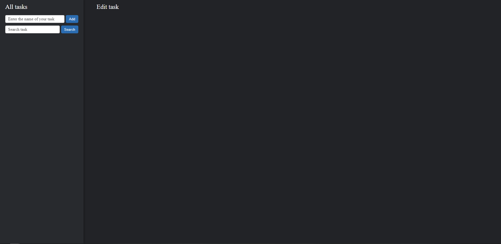

# Test task for a trainee for the position "JS programmer"

**Вы также можете прочитать этот README на [русском](https://github.com/klekwedge/todo-infotecs/blob/main/README.md)**

## Table of contents

- [Deployment instructions](#deployment-instructions)
- [Overview](#overview)
  - [Screenshot](#screenshot)
  - [Links](#links)
- [My process](#my-process)
  - [Built with](#built-with)
- [Author](#author)

## Deployment instructions

**To run the project, you need to have [npm](https://nodejs.org/en/) and [git](https://git-scm.com/downloads) installed on your computer**

1. Make a clone of this repository ```git clone https://github.com/klekwedge/todo-infotecs.git```
2. Install all required npm packages with ```npm i```
3. Run the project with the command ```npm run dev```

## Overview


### Given:
JS, CSS (SCSS, SASS)
The maximum time to complete the task is 2 weeks.
The goal of the assignment is to write a TODO List application.

### Basic goals:
- The application must include at least two main components (see the figure above for an example of the application):
 1) Vertical list with names of TODO notes;
 2) TODO note interaction area.
-  Implement the ability to add, edit and delete TODO notes;
- Trim the end of the TODO note name “…” if the name does not fit into the vertical list of TODO note names.

### Additional goals:
- Add color indication of progress status of TODO notes execution (states: pending/in progress/completed);
- Add TODO notes search by name;
- Add the ability to change the width of the list of names of TODO notes by holding and moving the right border with the mouse cursor;
- Implement an application in React+JS or React+TS (preferably use createReactApp https://create-react-app.dev/);

The use of frameworks and libraries other than React is not allowed. Commenting on code with explanations is a must.
Place the solution to the problem on https://github.com/
The link to the solution must be inserted into a Word file and attached to the internship application.

### Screenshot



### Links

- [Solution URL](https://github.com/klekwedge/todo-infotecs)
- [Live Site URL](https://klekwedge-todo-infotecs.vercel.app/)

## My process

### Built with

- React
- TypeScript
- SCSS

## Author

- [Website](https://klekwedge-cv.vercel.app/)
- [Linkedin](https://www.linkedin.com/in/klekwedge/)
- [Facebook](https://www.facebook.com/klekwedge)
